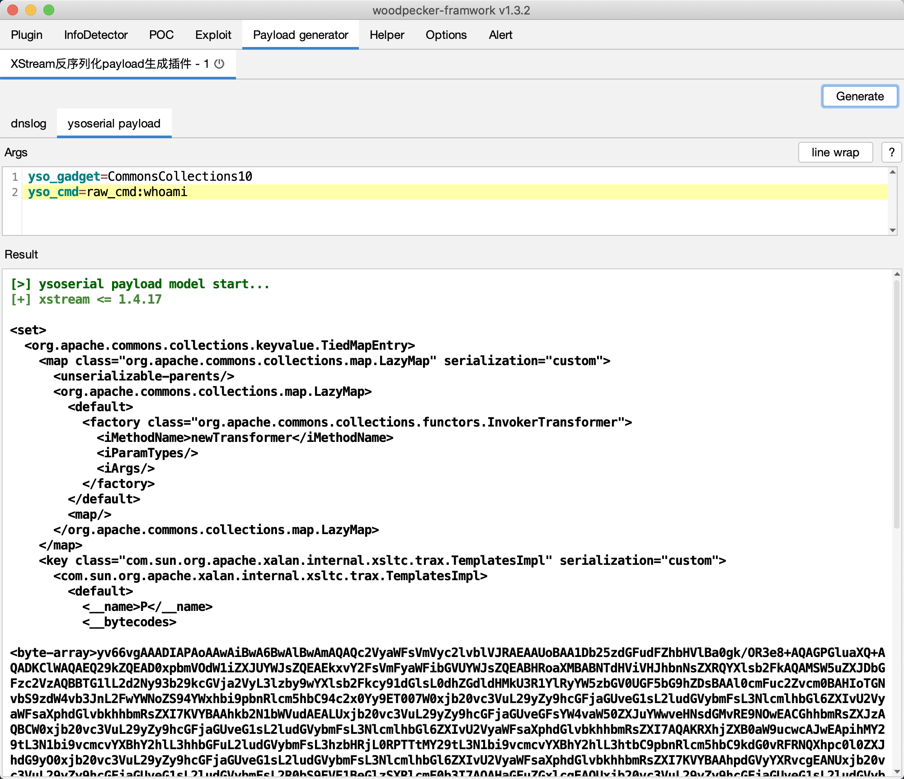

## 0x01 简介

`xstream-vuldb`是woodpecker框架快速生成XStream反序列化荷载插件,目前支持如下payload生成：

- [x] dnslog
- [x] ysoserial + xstream deserial

## 0x02 依赖
* [ysoserial-for-woodpecker](https://github.com/woodpecker-framework/ysoserial-for-woodpecker)

## 0x03 截图

